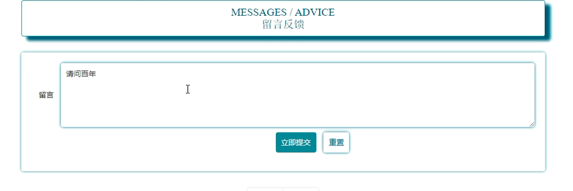
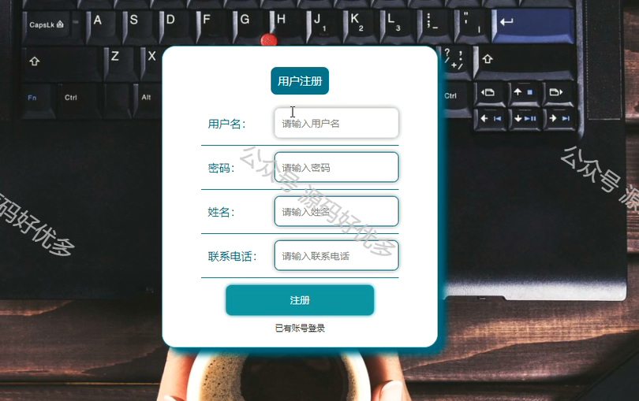
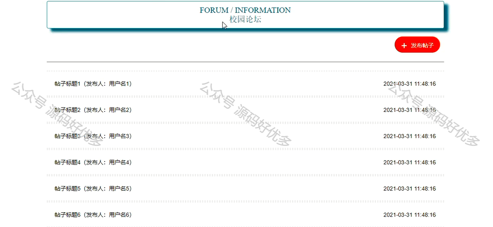
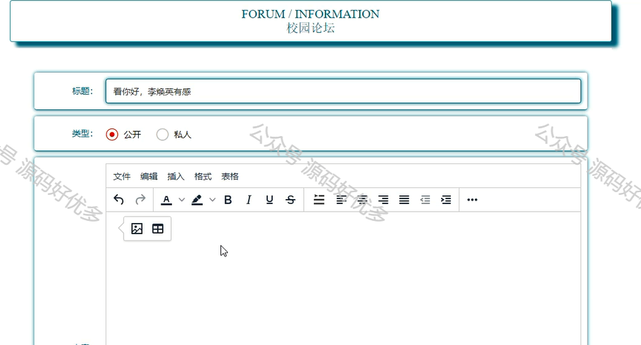
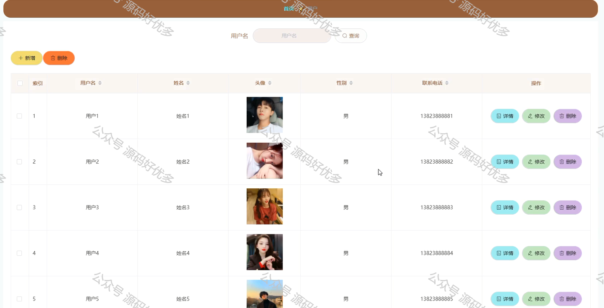
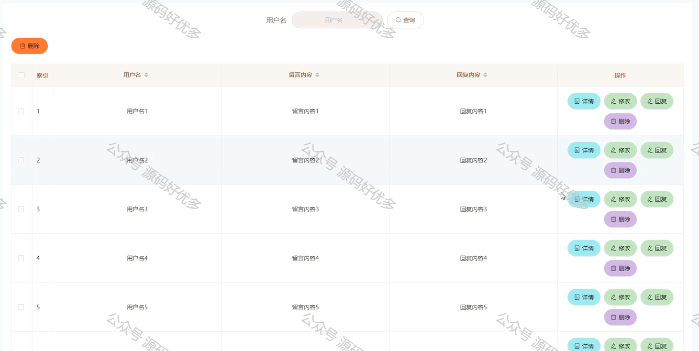
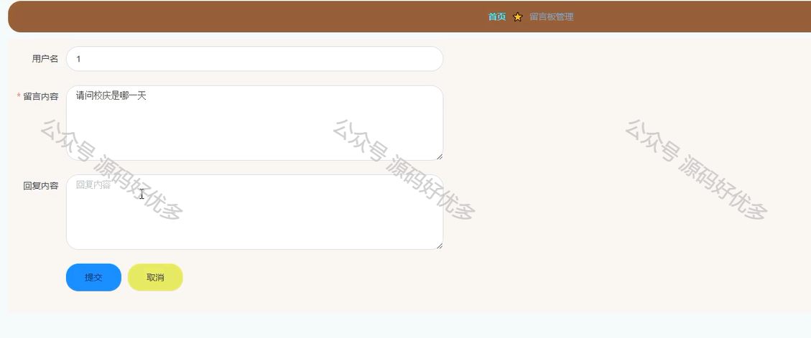

 

学院学生[论坛系统](https://so.csdn.net/so/search?q=%E8%AE%BA%E5%9D%9B%E7%B3%BB%E7%BB%9F&spm=1001.2101.3001.7020)的设计与实现
--------------------------------------------------------------------------------------------------------------

摘 要
---

网络的覆盖，电脑手机的普及使得人们的交流上升到网络信息化的层面上来，论坛系统就是在这样的环境下就诞生了，而且深受用户喜爱。

本学院学生论坛系统应用Java技术，[MYSQL数据库](https://so.csdn.net/so/search?q=MYSQL%E6%95%B0%E6%8D%AE%E5%BA%93&spm=1001.2101.3001.7020)存储数据，基于SSM+Vue框架开发。在网站的整个开发过程中，首先对系统进行了需求分析，设计出系统的主要功能模块，其次对网站进行总体规划和详细设计，最后对学院学生论坛系统进行了系统测试，包括测试定义，测试方法，测试方案等，并对测试结果进行了分析和总结，进而得出系统的不足及需要改进的地方，为以后的系统维护和扩展提供了方便。

本系统布局合理、色彩搭配和谐、框架结构设计清晰，具有操作简单，界面清晰，管理方便，功能完善等优势，有很高的使用价值。

\*\*关键字：\*\*论坛系统；Java技术；MYSQL数据库；Vue框架

Abstract
--------

The coverage of the Internet and the popularization of computer phones have made people’s communication rise to the level of network informationization. The forum system was born under such an environment, and it is deeply loved by users.

The student forum system of this college applies Java technology, MYSQL database stores data, and is developed based on the SSM+Vue framework. In the entire development process of the website, firstly, the system needs analysis, and the main functional modules of the system are designed. Secondly, the overall planning and detailed design of the website are carried out. Finally, a system test is carried out on the college student forum system, including test definitions and tests. Methods, test schemes, etc., and the test results are analyzed and summarized, and then the deficiencies of the system and the areas that need improvement are drawn, which provides convenience for future system maintenance and expansion.

The system has the advantages of reasonable layout, harmonious color matching, clear frame structure design, simple operation, clear interface, convenient management, and complete functions, and has high use value.

**Keyword:** Forum system; Java technology; MYSQL database; Vue framework

**目 录**

[摘 要](#_Toc68796920)

[Abstract](#_Toc68796921)

[第一章 绪论](#%E7%AC%AC%E4%B8%80%E7%AB%A0-%E7%BB%AA%E8%AE%BA)

[1.1研究背景](#11%E7%A0%94%E7%A9%B6%E8%83%8C%E6%99%AF)

[1.2 研究现状](#12-%E7%A0%94%E7%A9%B6%E7%8E%B0%E7%8A%B6)

[1.3 研究目标](#13-%E7%A0%94%E7%A9%B6%E7%9B%AE%E6%A0%87)

[第二章 相关技术介绍](#%E7%AC%AC%E4%BA%8C%E7%AB%A0-%E7%9B%B8%E5%85%B3%E6%8A%80%E6%9C%AF%E4%BB%8B%E7%BB%8D)

[2.1Java技术](#21java%E6%8A%80%E6%9C%AF)

[2.2Vue框架](#22vue%E6%A1%86%E6%9E%B6)

[2.3MYSQL数据库](#23mysql%E6%95%B0%E6%8D%AE%E5%BA%93)

[2.4 B/S结构](#24-bs%E7%BB%93%E6%9E%84)

[2.5 SSM框架](#_Toc68796931)

[第三章 系统分析](#%E7%AC%AC%E4%B8%89%E7%AB%A0-%E7%B3%BB%E7%BB%9F%E5%88%86%E6%9E%90)

[3.1 可行性分析](#31-%E5%8F%AF%E8%A1%8C%E6%80%A7%E5%88%86%E6%9E%90)

[3.1.1技术可行性](#311%E6%8A%80%E6%9C%AF%E5%8F%AF%E8%A1%8C%E6%80%A7)

[3.1.2经济可行性](#312%E7%BB%8F%E6%B5%8E%E5%8F%AF%E8%A1%8C%E6%80%A7)

[3.1.3操作可行性](#313%E6%93%8D%E4%BD%9C%E5%8F%AF%E8%A1%8C%E6%80%A7)

[3.1.4时间可行性](#314%E6%97%B6%E9%97%B4%E5%8F%AF%E8%A1%8C%E6%80%A7)

[3.2系统性能分析](#32%E7%B3%BB%E7%BB%9F%E6%80%A7%E8%83%BD%E5%88%86%E6%9E%90)

[3.2.1 系统安全性](#_Toc68796939)

[3.2.2 数据完整性](#_Toc68796940)

[3.2.3系统可扩展性](#_Toc68796941)

[3.3系统流程分析](#33%E7%B3%BB%E7%BB%9F%E6%B5%81%E7%A8%8B%E5%88%86%E6%9E%90)

[3.3.1注册流程](#331%E6%B3%A8%E5%86%8C%E6%B5%81%E7%A8%8B)

[3.3.2登录流程](#332%E7%99%BB%E5%BD%95%E6%B5%81%E7%A8%8B)

[3.4.3论坛发帖流程](#_Toc68796945)

[3.4系统功能分析](#34%E7%B3%BB%E7%BB%9F%E5%8A%9F%E8%83%BD%E5%88%86%E6%9E%90)

[3.4.1用户功能分析](#_Toc68796947)

[3.4.2管理员功能分析](#_Toc68796948)

[第四章 系统设计](#%E7%AC%AC%E5%9B%9B%E7%AB%A0-%E7%B3%BB%E7%BB%9F%E8%AE%BE%E8%AE%A1)

[4.1系统概要设计](#41%E7%B3%BB%E7%BB%9F%E6%A6%82%E8%A6%81%E8%AE%BE%E8%AE%A1)

[4.2 系统结构设计](#42-%E7%B3%BB%E7%BB%9F%E7%BB%93%E6%9E%84%E8%AE%BE%E8%AE%A1)

[4.3 数据库设计](#_Toc68796952)

[4.3.1数据库E-R图设计](#_Toc68796953)

[4.3.2数据库表设计](#_Toc68796954)

[第五章 系统的实现](#_Toc68796955)

[5.1 用户功能模块的实现](#_Toc68796956)

[5.1.1系统主界面](#_Toc68796957)

[5.1.2留言反馈界面](#_Toc68796958)

[5.1.3用户注册界面](#_Toc68796959)

[5.1.4用户登录界面](#_Toc68796960)

[5.1.5校园论坛界面](#_Toc68796961)

[5.2 管理员功能模块的实现](#_Toc68796962)

[5.2.1用户管理界面](#_Toc68796963)

[5.2.2留言板管理界面](#_Toc68796964)

[5.2.3系统公告管理界面](#_Toc68796965)

[5.2.4校园论坛管理界面](#_Toc68796966)

[第六章 系统测试](#_Toc68796967)

[6.1测试定义](#_Toc68796968)

[6.2测试方法](#_Toc68796969)

[6.3测试方案计划](#63%E6%B5%8B%E8%AF%95%E6%96%B9%E6%A1%88%E8%AE%A1%E5%88%92)

[6.4测试结论](#_Toc68796971)

[结束语](#_Toc68796972)

[致 谢](#_Toc68796973)

[参考文献](#_Toc68796974)

第一章 绪论
------

### 1.1研究背景

目前的时代是一个互联网加的时代，所有的信息都被网络覆盖，现在人们查询任何信息都可以随时随地的通过电脑来进行查询，有不懂的问题也可以通过浏览器输入查询得到解决办法，这样的生活方式深受大家的喜爱和接纳。

社会大环境都在变革，对于人们在交流讨论上的方式也应该上升到计算机这一层面，这样人们在日常工作生活中，如果遇到什么问题需要讨论，或者对某个领域不了解的时候，就可以通过专门的平台来进行发布这些话题，进行讨论，也就是在这一的情况下，论坛系统应运而生。

论坛的诞生实现了我们能够在虚拟的网络上与因有共同兴趣爱好或长项而集中的网友进行及时而方便的谈论，论坛系统真正实现了无地域局限，让地球每一个角落都能普及到的重要交流工具。所以我选择学院学生论坛系统的设计与实现这一课题作为毕业设计，目的是为校园用户提供一个便利的交流平台。

### 1.2 研究现状

国外软件行业起步早，发展迅速，软件开发的各种技术已经走向成熟阶段，国外对BBS论坛信息的管理早已进入信息化管理层面，不管查找帖子信息，修改对应帖子信息或者对某个不良用户进行言论限制或者禁言理由都可以充分进行管理。用户信息还有帖子信息管理便捷化迅速化。

在国内还有很大一部分人们并没有进行过BBS论坛的交流，他们交流方式还是存在一定局限性，只是局限在周边认识的亲戚朋友关系上面，信息沟通还有交流并不存在一定的讨论流程，如今信息流通速度加快，信息闭塞严重的话就会吃亏，因此交流就需要进一步扩大，自己知识面的不充分和缺乏就需要尽快弥补起来，这就需要一款交流软件来改变这样的局面，目前我国对于软件跟开发技术这块也在逐渐进步，研究内容也在不断的深入，开发出一款针对BBS论坛信息的管理的系统并非难事。

### 1.3 研究目标

本系统主要是设计出学院学生论坛系统，界面风格要美观，不能出现丢失数据，信息呈现混乱等问题。要可以高效地存储和查询数据，从而保证网站可以的正常进行。研究目标如下：

（1） 界面优化：界面简洁、美观，易于用户操作。系统中大部分功能通过控件实现，使得运行界面十分简洁，用户可以方便地完成查贴、发帖、回复等各类操作。

（2）功能设计：学院学生论坛系统主要满足两类用户的需求，即用户以及管理员，实现不同用户的权限登录。

（3）各类信息管理，提高效率。各类信息由管理员及时进行管理。

第二章 相关技术介绍
----------

### 2.1Java技术

Java是一种非常常用的编程语言，在全球编程语言排行版上总是前三。在方兴未艾的计算机技术发展历程中，Java的身影无处不在，并且拥有旺盛的生命力。Java的跨平台能力十分强大，只需一次编译，任何地方都可以运行\[9\]。除此之外，它还拥有简单的语法和实用的类库，让编程人员可以尽可能将精力集中在问题的求解上，并且许多开源项目和科研成果都是采用它实现的。

在1995年这一年的5月份，著名的Sun Microsystems公司在程序开发设计上面郑重推出一种面向对象开发的程序设计语言——Java，最开始的时候Java是由詹姆斯.高斯林这位伟大的JAVA之父来进行主导，但是在后来由于各种原因，让甲骨文公司这个针对商业程序创建了oracle大型数据库的公司收购了Java。Java的平台总共算下来有3个，分别为javaME和javaSE以及javaEE这3个java平台。下面将对其进行分别介绍。

（1）在电脑桌面程序的开发上面需要选择JavaME，这个用得也比较多。

（2）企业也会根据工作以及业务需要开发各种软件，那么就会选用JavcEE这个支持企业版软件的开发的Java平台，JavcEE主攻运用在企业领域上面的web应用，JavcEE也在javaSE的基础上获得了比如jsp技术 ，Servlet技术等程序开发技术的支持。

（3）现在生活中手机的普及化，也使得手机端这样的移动设备的软件的兴起，JavaME这个迷你版java平台就能运用于移动端的软件开发操作。

### 2.2Vue框架

Vue是当今前端的三大框架之一，主要技术领域运用到的是单页SPA的应用之中。这样很好的提供了用户的浏览网页的交互体验。减少了浏览器的负载。提高浏览器的高效的浏览的速度。

Vue 是一套用于构建用户界面的渐进式框架。Vue 被设计为可以自底向上逐层应用。Vue 的核心库只关注视图层，不仅易于上手，还便于与第三方库或既有项目整合。另一方面，当与现代化的工具链以及各种支持类库结合使用时，Vue 也完全能够为复杂的单页应用提供驱动。Vue可以在任意其他类型的项目中使用，使用成本较低，更加灵活，主张较弱，在Vue的项目中也可以轻松融汇其他的技术来开发，而且因为Vue的生态系统特别庞大，可以找到基本所有类型的工具在vue项目中使用。其特点：易用（使用成本低），灵活（生态系统完善，适用于任何规模的项目），高效（体积小，优化好，性能好）。

VUE的出现，加快了前后端分离的进程，提高了程序员的工作效率，也减少了工作时间。Vue.js是一套用于构建用户界面的，可以自底向上逐层应用的渐进式前端框架。它相比于其他主流的JavaScript框架例如AngularJS或React都具有运行效率高、语法简洁、自身占用空间小、上手容易等特点。它的核心只关注视图层，是一个允许采用简洁的模板语法来声明式地将数据渲染进DOM的系统，并且所有的这些都是响应式的。

### 2.3MYSQL数据库

MySQL是典型的关系数据库系统，拥有开源免费、稳定、高效等特点，一直是中小型web项目的最佳数据库选择。MySQL作为当今IT领域使用人数最多的开源关系型数据库软件之一，在2018年的数据库使用率排名中位居第二，仅次于目前为止最成功的商业版数据库Orcle\[12\]。MySQL最大的优势之一就是无偿使用，这也是它成功的关键。

MySQL支持标准化数据库查询语言SQL。MySQL是一款非常适合个人开发者或小型组织开发团体的数据库管理系统，因为它是开源并且免费的，体积小、速度快、成本低以及其最重要的一点开放源码，深受程序设计人员的喜爱，这也让它成为了许许多多中小型开发网站数据库的首选，同时提供了多种开发的连接API。MySQL将数据的存放按照记录之间的关系存放到了不同的表中，减少了数据的冗余并且提高了开发的工作效率。MySQL支持开发中需要用的大型数据库，并能处理数以万计的记录。因为MySQL是开源的软件，所以在项目的预算中的时候不用花费额外的资金，大大降低了开发的总体成本，这也是MySQL数据库在中小型企业和独立的开发者中广泛流行的原因\[11\]。

### 2.4 B/S结构

在早期的程序开发中，使用得最多的莫过于C/S架构了，现在的生活中软件在生活的各个方面落地，使用了C/S架构开发出来的软件也是不在少数的，比如企业日常办公使用到的微软的OFFICE软件，我国自己研发的文档处理软件WPS，还有娱乐软件腾讯的QQ，腾讯的微信，以及电脑上安装的杀毒软件金山杀毒软件，瑞金杀毒软件等都是C/S架构。但是在Internet网络盛行之后，鉴于大家对数据信息共享的需求，在原来的C/S架构上进行了升级改进之后，有了现在的主流架构B/S架构，B/S架构就是在C/S架构上多了一个浏览器，让原来的直接访问服务器的方式，变成了通过浏览器去访问服务器。充分运用到了当下不断成熟的浏览器技术。也让软件的开发成本以及维护成本降低了。可以说B/S这种新型的架构模式让软件的开发变得便利化。

### 2.5 SSM框架

本学院学生论坛系统基于Spring、SpringMVC、Mybatis框架进行开发设计。

Spring 框架是在2004年首次发布，之后出现了多次的重大修订。Spring框架是由七个不同的模块组成，分别是SpringCore、Spring AOP、Spring ORM、Spring DAO、Spring Web Flow、Spring Context和Spring Web MVC\[16\]。这些模块提供不同的平台来开发不同的企业应用程序 ，本课题使用Spring Web MVC模块开发基于MVC的应用程序。

Spring Web MVC是基于Servlet API的原始Web框架，从一开始就包含在Spring 框架中。“Spring Web MVC”是该框架的正式名称，但通常被简称为“Spring MVC” \[17\]。Spring MVC框架提供了模型模块-视图模块-控制器的架构和可用于直接开发的Web应用程序的现成组件。Spring MVC模式将应用程序的不同方面分开，使元素之间形成松散耦合。

MyBatis原名叫做iBatis属于持久层框架，消除了大部分JDBC代码和参数的设置以及结果集的检索。这个框架不仅支持普通SQL查询和存储过程，还支持高级的映射\[18\]。MyBatis使用.xml和注解来做原始映射和配置，将接口和Java对象映射成数据库记录。

第三章 系统分析
--------

### 3.1 可行性分析

需要使用大部分精力开发的学院学生论坛系统为了充分降低开发风险，特意在开发之前进行可行性分析这个验证系统开发是否可行的步骤。本文就会从技术角度，经济角度，还有操作角度等进行综合阐述。

#### 3.1.1技术可行性

本文将开发的系统，将采用的关键技术包括JAVA编程语言、B/S架构、MYSQL数据库存储技术等。另外，程序开发需要在自己电脑上安装的软件并不多，在win7操作系统的大环境下，能够完全搭建好程序开发的操作环境，比如开房工具，MYSQL数据库工具，以及处理程序图片的Photoshop工具等都能安装在自己的电脑上。总的说来，开发这个程序在技术上是可以实现的，该项目的开发是有保障的。

#### 3.1.2经济可行性

开发这个程序软件并不会涉及到经济上面的开销，在开发软件的选择上也不会额外付费安装软件，在开发软件的官网上面就可以下载需要的软件，并根据提示的安装步骤安装软件到自己的电脑上面。因此，该项目的实施在经济上完全可行。

#### 3.1.3操作可行性

操作可行性主要是针对系统用户而言，一个系统再完美，技术再先进，用户不去使用，或者用户根本不会使用，该系统存在的价值也是不大的。本系统拟采用的是B/S架构，用户只要通过点击浏览器即可轻松访问，而用户对浏览器操作非常熟练，所以从用户的角度而言，没有任何学习成本，因此，操作上是可行性的。

#### 3.1.4时间可行性

从时间上看，在三个月的时间里学习相关知识，开发本学院学生论坛系统，时间上是有点紧，但是不是不可能实现，在做毕业设计的这几个月里，我通过努力使得功能应该基本可以实现。

从上面几个部分的可行性分析得出，这次开发的学院学生论坛系统在开发上面没有什么大问题，值得开发。

### 3.2系统性能分析

#### 3.2.1 系统安全性

程序在使用中是不允许其他访问者随意窃取程序里面的隐秘信息，也不允许其他操作者越权操作其他管理用户操作的功能，要真正杜绝这些现象就必须在程序开发之前把程序的安全性给考虑进去。

比如现在很多程序都会把用户注册的功能给考虑进去，让用户在注册页面功能区填写自己的个人信息，这些数据信息涵盖了用户本人的姓名，用户对程序登录设置的密码，用户经常使用的邮箱，用户的常用联系方式还有用户的所住地址等信息，这些信息都是设计到用户本人的隐私，那么这些信息在传输给程序后台时，是需要进行管理并保存至对应的数据库文件里面。要是有人恶意窃取程序的数据信息，也就会让那些注册了此程序软件的用户的个人隐秘信息都会遭到泄露。这些信息落入其他不法分子手里，他们极有可能根据用户的隐私信息去骚扰用户，并把这些信息用于各种商业用途谋取其他非法的利益。所以数据安全性是一个系统能不能使用的首要标准。

#### 3.2.2 数据完整性

数据完整性是确保数据信息是否具有可靠性，是否具有参考价值的一个重要因素，数据信息只描述一部分，或者必有的数据信息反而为空等现象都是代表着这个数据信息不完整，有数据缺陷，这是个很严肃的问题，因为这样的数据信息跟垃圾信息没什么两样。

说到数据完整性，不得不提最常用的程序表单功能。这些表单主要就是提取广大用户的数据信息的，需要广大用户根据表单上的要求，填写自己的姓名信息，以及自己的联系方式信息，有些也会有额外的信息填写要求，有必须要填的选项，也有不需要必填的选项。假如广大用户为了保护自己的隐私，或者不想受到其他人的骚扰，不填写必填项等信息，广大用户在最后提交此表单的时候，往往都是提交不了的。

由于数据表之间也会存在一定的联系，所以同一个数据也会出现在另一个表格里面，那么这两个表格记录的同一个数据应该是一样的。不能够是同样的数据信息在不同表中不一样。

#### 3.2.3系统可扩展性

一切事物都是一直在发展，程序员开发软件也需要带着发展的思维去进行软件开发操作，这样的话，开发出来的程序在应对管理所需时，也会相对应的进行程序升级与更新。不论是功能完善还是数据库升级都能在原来的基础上对原有程序进行迭代升级。让开发出来的程序能够走得越来越远。这也是广大用户对程序软件的使用要求。

### 3.3系统流程分析

#### 3.3.1注册流程

未有账号的用户可进行注册操作，用户注册流程图如图3.1所示。

图3.1注册流程图

#### 3.3.2登录流程

登录模块主要满足了管理员和用户的权限登录，用户登录流程图如图3.2所示。

图3.2 登录流程图

#### 3.4.3论坛发帖流程

用户论坛发帖前提必须是登录后才能进行，发帖内容不能为空，且合法才能进行提交发表成功。详见图3.3所示。

图3.3 论坛发帖流程图

### 3.4系统功能分析

本学院学生论坛系统主要分管理员和用户两大功能模块，下面将详细介绍管理员和用户分别实现的功能。

#### 3.4.1用户功能分析

用户在系统前台可查看系统信息，包括首页、校园论坛、系统公告以及留言反馈等，用户要想实现发帖等操作，必须登录系统，没有账号的用户可进行注册操作，注册登录后主要功能模块包括个人中心、我的发布。用户用例图如图3.4所示。

图3.4 用户用例图

#### 3.4.2管理员功能分析

管理员可登录系统后台对系统进行全面管理操作，管理员主要功能模块包括个人中心、用户管理、留言板管理、校园论坛以及系统管理。 管理员用例图如图3.5所示。

图3.5 管理员用例图

第四章 系统设计
--------

### 4.1系统概要设计

本学院学生论坛系统采用B/S结构来开发，这种结构是在互联网兴起后出现的，是一个适用于互联网环境下的模型结构，用户只要能上网通过浏览器就可以在任何时间、任何地点的使用。系统工作原理图如图4-1所示：

图4.1 系统工作原理图

### 4.2 系统结构设计

系统整体设计是一个将一个庞大的任务细分为多个小的任务的过程，这些小的任务分段完成后，组合在一起形成一个完整的任务。本学院学生论坛系统主要包括用户功能模块和管理员功能模块，系统功能模块图如图4.2所示。

图4.2 系统功能模块图

### 4.3 数据库设计

#### 4.3.1数据库E-R图设计

E-R图是一种描述显示数据类型间的关系的数据描述方法，E-R图可以完整地映射出现实模型的关系。E-R图中的三个最为重要的元素就是实体、属性、关系。本学院学生论坛系统的E-R图如下所示：

（1）校园论坛信息实体E-R图如图4.3所示：

图4.3 校园论坛信息实体属性图

（2）管理员信息实体E-R图如图4.4所示：

图4.4 管理员信息实体属性图

（3）留言板信息实体E-R图如图4.5所示：

图4.5 留言板信息实体属性图

（4）系统公告信息实体E-R图如图4.6所示：

图4.6 系统公告信息实体属性图

（5）用户信息实体E-R图如图4.7所示：

图4.7用户信息实体属性图

#### 4.3.2数据库表设计

学院学生论坛系统采用MYSQL数据库作为数据存储，下面介绍数据库中的各个表的详细信息。

表4.1 forum校园论坛信息表

| 列名 | 数据类型 | 长度 | 允许空 | 说明 |
| --- | --- | --- | --- | --- |
| id | bigint | 20 | 否 | 编号 |
| addtime | timestamp |  | 是 | 创建时间 |
| title | varchar | 200 | 是 | 帖子标题 |
| content | longtext |  | 是 | 帖子内容 |
| parentid | bigint | 20 | 是 | 父节点编号 |
| userid | bigint | 20 | 是 | 用户编号 |
| username | varchar | 200 | 是 | 用户名 |
| isdone | varchar | 200 | 是 | 状态 |

表 4.2 users管理员信息表

| 列名 | 数据类型 | 长度 | 允许空 | 说明 |
| --- | --- | --- | --- | --- |
| id | bigint | 20 | 否 | 编号 |
| username | varchar | 100 | 是 | 用户名 |
| password | varchar | 100 | 是 | 密码 |
| role | varchar | 100 | 是 | 角色 |
| addtime | timestamp |  | 是 | 新增时间 |

表 4.3 messages留言板信息表

| 列名 | 数据类型 | 长度 | 允许空 | 说明 |
| --- | --- | --- | --- | --- |
| id | bigint | 20 | 否 | 编号 |
| addtime | timestamp |  | 是 | 创建时间 |
| userid | varchar | 200 | 是 | 留言人编号 |
| username | varchar | 200 | 是 | 用户名 |
| content | longtext |  | 是 | 留言内容 |
| reply | longtext |  | 是 | 回复内容 |

表4.4 news系统公告信息表

| 列名 | 数据类型 | 长度 | 允许空 | 说明 |
| --- | --- | --- | --- | --- |
| id | bigint | 20 | 否 | 编号 |
| addtime | timestamp |  | 是 | 创建时间 |
| title | varchar | 200 | 是 | 标题 |
| introduction | longtext |  | 是 | 简介 |
| picture | varchar | 200 | 是 | 图片 |
| content | longtext |  | 是 | 内容 |

表4.5 yonghu用户信息表

| 列名 | 数据类型 | 长度 | 允许空 | 说明 |
| --- | --- | --- | --- | --- |
| id | bigint | 20 | 否 | 编号 |
| addtime | timestamp |  | 是 | 创建时间 |
| yonghuming | varchar | 200 | 是 | 用户名 |
| mima | varchar | 200 | 是 | 密码 |
| xingming\` | varchar | 200 | 是 | 姓名 |
| touxiang | varchar | 200 | 是 | 头像 |
| xingbie | varchar | 200 | 是 | 性别 |
| lianxidianhua | varchar | 200 | 是 | 联系电话 |

第五章 系统的实现
---------

### 5.1 用户功能模块的实现

#### 5.1.1系统主界面

用户进入本系统可查看系统信息，主要包括首页，校园论坛以及系统公告等，系统主界面展示如图5.1所示。

图5.1网站主界面

#### 5.1.2留言反馈界面

用户登录后可进行留言反馈操作，留言反馈界面展示如图5.2所示。

图5.2 留言反馈界面

#### 5.1.3用户注册界面

未有账号的用户可进入注册界面进行注册操作，用户注册界面展示如图5.3所示。

图5.3用户注册界面

#### 5.1.4用户登录界面

用户在登录界面可输入正确的登录信息，点击提交按钮进行登录操作，用户登录界面展示如图5.4所示。

图5.4用户登录界面

#### 5.1.5校园论坛界面

用户在校园论坛界面可查看已有帖子信息，并可查看详情，登录后可进行发帖、评论等，校园论坛界面展示如图5.5所示，发帖界面展示如图5.6所示。

图5.5校园论坛界面

图5.6 发帖界面

### 5.2 管理员功能模块的实现

#### 5.2.1用户管理界面

管理员可查看、添加、修改和删除用户信息，用户管理界面展示如图5.7所示。

图5.7 用户管理界面

#### 5.2.2留言板管理界面

管理员可查看留言板信息，并可进行回复、修改和删除操作，留言板管理界面展示如图5.8所示，回复界面展示如图5.9所示。

图5.8 留言板管理界面

图5.9 回复信息界面

第六章 系统测试
--------

### 6.1测试定义

系统测试主要是判断系统是否可以正常运行，功能模块是否可以实现操作。程序代码中是否有错误出现。测试程序是开发过程中的一个主要问题。就算系统完成的再好，再进行程序测试时也会也会发现一个重来没有被发现的错误信息。

测试不仅是系统开发的开始，而且应该贯穿整个系统的整个生命周期。评估系统质量的方法不局限于系统编码和过程，应该与软件设计工作和历史需求分析密切相关。系统错误，不一定是代码错误，可能是阶段的设计摘要和设计细节存在问题，问题也可能出现在需求分析阶段。从实际情况来看，最初的问题很可能是一个小错误，根据按钮的原理，按钮后的按钮位错将是所有位错。该系统的原因也同样适用，随着后续的开发工作，误差将越来越严重。所以越早发现问题，更好的将是解决问题的早期阶段，为了避免问题在后续编码，测试和设计，避免扩大国家的问题。在测试系统中，开发人员应该站在客户的角度来处理测试工作，而现在主要的测试方法是黑盒测试。测试的目的可以概括为以下几点:首先，用户界面和客户需求是一致的，设置界面和设计风格统一;第二，创新设计接口规范设计标准，具有独特的审美特征;最后，人类传统的接口以满足审美需求，不能盲目地追求一种独特的，合理的规划布局，符合审美标准。

### 6.2测试方法

运用黑盒子测试的测试办法，把各个不同功能的软件模板进行区分、管理。对于不同的模块独立的分装起来，在传统测试的时候要进行数据的统一测试，完成对系统的概要设计详细解读资料、需要解决的问题，及操作的详细应用说明等内容来视作测试的突破口，对测试的对象进行逐一对照检查，并针对单个的程序检测延伸至这个研发过程中单个及整个集成单元的检测中，要有规律有顺序的进行，不但可以缩短我们的工作时效，避免返工的操作，也可以对可用性负责，提高了可操作性和软件研发的实用性。通过对系统概要设计验证测试，测试系统的统一管理方式，对系统的各个功能模块以及系统的性能进行测试，验证系统的功能以及系统的性能。

### 6.3测试方案计划

对测试计划的把握是测试方案的重中之重。所有的技术难点应该都被包含在这个测试计划之中。而且我们要保证能与目标形成一致性，以至于能够测试出一些主要存在的错误和一些错误的漏洞。可以完美解决这些问题就只有白盒测试或者黑盒测试。

构造测试是白盒测试的另一个名字，了解与分析程序的结构以及性能功用的，从而我们可以得到最终想要的结果并且观察出是不是每一条程序都能得到。

性能测试是黑盒测试别称，程序本身的运作通过程序的进程来观察，主要是看一下程序是不是能够像我们预期的目标那样发展，看一看我们的程序最终能不能完整的得到我们最后想要的功能和储存想得到的数据，到最后看一下我们的这个程序完整性能不能达到要求。

（1）模块测试

单元测试就是模块测试，顾名思义就是测试每个模块所承担的功能是否能够实现，这个测试就是为了找出代码在实际的设计运转中某一些小的程序所出现的偏差，很好地改正这些错误，就说明我们模块测试进行很成功过。

（2）集成测试：

集成测试就是对系统的测试以及对他子系统的一些性能测试，他检查的事系统的包装程序信息。找出其中的问题。他的优势主要有以下这几点：

软件耗费较少。

可以提前发现端口的错误。

更好的地位系统中错误的位置。

从底部往上面进行的方案针对于偏下层的结构，而中间的结构就采用折中的方法。

（3）验收测试：

终于到了结尾性的工作了。就是为了给用户看一下我们的系统功能是否达到了预期的效果。我采用了性能测试也就是黑盒测试对系统进行测试。

其结果是分别是：

有一定的差异在用户的需求。

再者就是结果与之差不了多少。

到了最后了，我们发现的问题都是与用户的需求存在一定的关联。

### 6.4测试结论

经过对总体测试分析，本学院学生论坛系统运行时均能执行其相应功能，均能实现查看、添加、删除、编辑等功能，且运行显示正常，后台数据库也运行良好，数据保证了一致性和稳定性，各个功能模块运行正常达到了预期的开发目标。

总体说来，软件通过测试。

结束语
---

通过对本学院学生论坛系统的开发，我对系统开发有一个更清楚的了解，系统的开发过程中，首先是对问题的定义，分析要求，然后功能设计，详细设计等和软件测试的方法，有了更深刻的认识，同时，也拓宽了我计算机的知识，我觉得收获不小。

本人将大学期间所了解到的计算机工程理论知识运用到了本次的毕业来发中来。即对基础学问进行了加强，同时也增加了动手能力。在这段时期里，我查找了很多相关的资料，查阅了很多Java的相关文献，结合自己的经验，设计了这个学院学生论坛系统，虽然每个学期学校都会针对动手练习进行相应的课程设计，但是在学院学生论坛系统的具体设计中还是遇到了一些小问题，但在不断的学习、研究中都将问题一一解决，在一一克服的过程中，我也得到了成长，知识和经验也得到了丰富，这对我来说是一笔巨大的财富。

通过这套学院学生论坛系统的开发，我巩固了之前学过的知识，平时所学到的知识不仅融合了，我深人体会到学科之间的关联效应。在整个设计过程中明白了许多东西，也培养独立工作能力，树立信心，提高了自己的工作能力，我相信在以后的学习和工作生活中有至关重要的作用。这次设计也大大提高了我的动手的能力，让我在学习中充分体会到了探索的乐趣，享受成功的创作过程，在本次设计过程中汲取的东西，是一笔宝贵的财富，让我受益匪浅。

致 谢
---

为期一个学期的毕业论文（设计）已接近尾声了，我的大学生活也即将要画上一个圆满的句号。此刻我的心感到无比惆怅失落，对于熟悉我的老师和所有可爱的同学们，我们很快就会挥手告别。在即将毕业之际，我的心情实在难以平静，从最开始的学习专业知识到刚开始参加毕业课题讨论到最后论文的顺利完成，我身边的亲朋好友给了我极其多的帮助，这些帮助大多是雪中送炭，帮助我渡过了很多难关。因此，我要想对我伸出过援助之手的可爱的朋友、老师、家人们表示衷心的感谢。

首先要对我本次论文的指导老师表示深深的敬意，他对于我的学习和生活给予了最多的关怀和最悉心的指导。同时，我还要感谢大学期间我所有的带课老师，他们对我的生活、学习等各方面都付出了许多关怀，没有他们的带领，我不会成为一名合格的毕业生没有他们在课堂上认真详细教程，辅导班，我无法顺利完成毕业设计，我想向他们表达最真诚的感谢！感谢我们学院的所有领导，为我提供所需要的设备和资料！还要感谢我身边的同学和朋友们，感谢他们对我的关心和帮助！

我还要感谢我最亲近的家人，是因为有了他们在学业上对我的全力支持以及在生活上的关怀才能支撑着我走到现在！

在最后要祝愿学校的领导教师以及和我一起奋斗的同学们工作顺利，事业有成，也要祝愿学校的前景更加辉煌。

向所有关心我的同学和老师表示最真挚的感谢。

参考文献
----

\[1\] 王波编著.Java架构师指南\[M\].人民邮电出版社,2018:22-113.

\[2\] 王玉英. 基于Java的MYSQL数据库访问技术\[J\]. 现代计算机：专业版， 2010， 19(14):63-66

\[3\] 张孝祥、徐明华，JAVA基础与案例开发详解， 清华大学出版社， 2009.

\[4\]张宁,吴捷,杨卓,张涛. 基于MYSQL的脑电数据库的构建\[J\]. 广西科学院学报 ,2006 22(4)：275-278.

\[5\]苟凌怡，魏生民. MYSQL中索引的有效选取\[J\].计算机工程与应用,1999，35（6）:70－71.

\[6\]张永强.计算机软件Java编程特点及其技术分析\[J\].计算机产品与流通,2019(01)

:23.

\[7\]秦楷.JAVA语言特点及其在计算机软件开发中的运用\[J\].中国新通信,2019(01):91

\[8\]程小红. 基于Java的数据库应用框架的设计分析\[J\]. 电子设计工程，2018,26（21）:90-94.

\[9\]黎雪琴,程多浪,张思平,孙新杰.信息管理系统设计过程中常见问题及对策研究\[J\].电脑知识与技术,2020,16(09):5-6.

\[10\]张振超,吴杰,陈序蓬.浅谈Java中Mysql数据库的连接与操作\[J\].信息记录材料,2020,21(02):144-145.

\[11\]基于Vue.js的Web前端应用研究\[J\]. 朱二华.科技与创新.2017(20)

\[12\]贺平.《软件测试教程》.电子工业出版社.2004

\[13\]Pratiwi Rimadani, Shalihat Ayu, Dewantisari Deti, et al. Correlation study between gastronomy culture and content of selenium towards prevalence of cardiovascular and diabetes in West Java, Indonesia. 2021, 64

\[14\]Arief Ginanjar, Mokhamad Hendayun. Spring Framework Reliability Investigation Against Database Bridging Layer Using Java Platform. 2019, 161:1036-1045.

\[15\]Lunghi Carlotta,Zongo Arsène,Tardif Isabelle,Demers Éric,etc. Depression but not non-persistence to antidiabetic drugs is associated with mortality in type 2 diabetes: A nested case-control study\[J\]. Diabetes Research and Clinical Practice,2021,171.

\[16\] 郝佳编著.Spring源码深度解析\[M\].人民邮电出版社,2019:5-98.

\[17\] \[美\]Paul Deck著.林仪明译.Spring MVC学习指南\[M\].人民邮电出版社,2017:14-113.

\[18\] 李艳鹏\[等\]编著.互联网轻量级SSM框架解密\[M\].电子工业出版社,2019:19-98.

 

